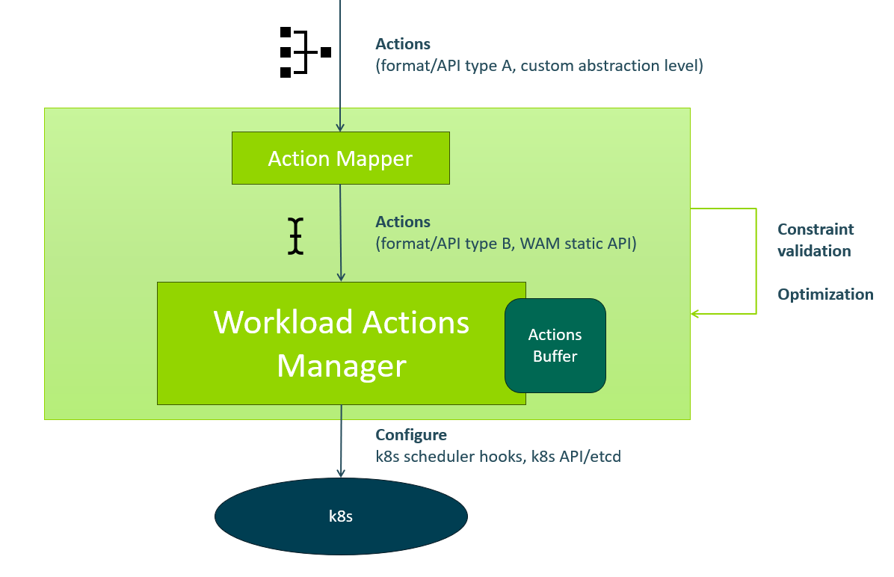

# Workload Actions Manager (WAM)

[](https://www.gnu.org/licenses/gpl-3.0)
[](https://github.com/ACES-EU/workload-actions-manager/actions/workflows/test_and_build.yaml)




The Workload Actions Manager (WAM) is a specialized service integrated into the Kubernetes control plane, designed to manage and orchestrate workload actions for Smart AIOps entities. These entities, which include both centralized AIOps reschedulers and decentralized agents, utilize the WAM API to initiate specific actions. WAM oversees the coordination, task assignment, and interaction with various components required to perform workload actions such as creating or removing pods. Due to its distributed architecture, WAM emphasizes parallel and asynchronous execution of actions. Entities are notified of action completions via a separate endpoint, indicating whether the action was successful or not.

To ensure high availability and fault tolerance, WAM is deployed with multiple replicas, all accessible through a single Kubernetes Service with a known domain and port. The system leverages a fault-tolerant persistent message queue to store scheduling recommendations. AIOps entities interact with WAM by sending action requests through the API, with WAM then executing these actions efficiently while maintaining fault tolerance.

The design of the WAM component architecture aims to minimize custom logic by delegating tasks to existing Kubernetes components like the ReplicaSet controller to accomplish the required workload actions. For enhanced flexibility and customization, the Kubernetes scheduler is extended with custom scheduler plugins, allowing for tailored scheduling processes to meet unique requirements.

WAM implements four primary actions—create, delete, move, and swap—which are generally sufficient for most directives from AIOps entities or to implement higher-level actions. While these foundational actions cover most use cases, some scenarios may necessitate additional logic or more complex actions. The abstraction level required for actions depends on the output from MLOps entities and the target orchestration technology, necessitating a component that bridges different abstraction levels. A possible solution is a scheduler-specific action mapping component that converts scheduler-specific concepts into foundational actions. This component can implement high-level actions using low-level actions, such as moving an entire application from one edge environment to another, or it may include advanced resource characterization capabilities, like placing workloads on nodes with fewer than three pods and average RAM utilization below 50%.


## Requirements

- [Docker](https://docs.docker.com/get-docker/)
- [Kubectl](https://kubernetes.io/docs/tasks/tools/#kubectl)
- [K3d](https://k3d.io/v5.2.2/#installation)
- [Just](https://github.com/casey/just?tab=readme-ov-file#installation)
- [Helm](https://helm.sh/docs/intro/install/)

## Create a Cluster

```bash
grep k3d-registry.localhost /etc/hosts || echo "127.0.0.1 k3d-registry.localhost" | sudo tee -a /etc/hosts
k3d cluster create --config deploy/k3d.yaml --api-port localhost:5443
```

## Build

TODO

## Deploy

```bash
helm install wam-redis deploy/redis
kubectl apply -f deploy/wam-scheduler
kubectl apply -f deploy/wam
kubectl apply -f deploy/test
kubectl port-forward wam_pod_name 3000:3000
```

## Examples

```bash
# create a replica of A on node 7
curl -X POST -H "Content-Type: application/json" \
  -d '{"method":"action.Create","params":[{"workload": {"namespace": "default", "apiVersion": "apps/v1", "kind": "Deployment", "name": "test-a"}, "node": {"name": "k3d-aces-agent-7"}}], "id":"1"}' \
  http://localhost:3000/rpc
  
# create a replica of A on node 4
curl -X POST -H "Content-Type: application/json" \
  -d '{"method":"action.Create","params":[{"workload": {"namespace": "default", "apiVersion": "apps/v1", "kind": "Deployment", "name": "test-a"}, "node": {"name": "k3d-aces-agent-4"}}], "id":"1"}' \
  http://localhost:3000/rpc

# delete a replica of A on node 7
export pod_to_delete=$(kubectl get pods -l app=test-a -o wide | grep 'k3d-aces-agent-7' | awk '{print $1}' | head -n 1)
echo "$pod_to_delete"
curl -X POST -H "Content-Type: application/json" \
  -d "{\"method\":\"action.Delete\",\"params\":[{\"pod\": {\"namespace\": \"default\", \"name\": \"$pod_to_delete\"}}], \"id\":\"1\"}" \
  http://localhost:3000/rpc

# move a replica of A from node 4 to node 7
export pod_to_move=$(kubectl get pods -l app=test-a -o wide | grep 'k3d-aces-agent-4' | awk '{print $1}' | head -n 1)
echo "$pod_to_move"
curl -X POST -H "Content-Type: application/json" \
  -d "{\"method\":\"action.Move\",\"params\":[{\"pod\": {\"namespace\": \"default\", \"name\": \"$pod_to_move\"}, \"node\": {\"name\": \"k3d-aces-agent-1\"}}], \"id\":\"1\"}" \
  http://localhost:3000/rpc
  
# create a replica of B on node 4
curl -X POST -H "Content-Type: application/json" \
  -d '{"method":"action.Create","params":[{"workload": {"namespace": "default", "apiVersion": "apps/v1", "kind": "Deployment", "name": "test-b"}, "node": {"name": "k3d-aces-agent-4"}}], "id":"1"}' \
  http://localhost:3000/rpc

# create another replica of B on node 4
curl -X POST -H "Content-Type: application/json" \
  -d '{"method":"action.Create","params":[{"workload": {"namespace": "default", "apiVersion": "apps/v1", "kind": "Deployment", "name": "test-b"}, "node": {"name": "k3d-aces-agent-4"}}], "id":"1"}' \
  http://localhost:3000/rpc

# swap replica of A (node 7) with replicas of B (node 4)
curl -X POST -H "Content-Type: application/json" \
  -d '{"method":"action.Swap","params":[{"x": {"namespace": "default", "name": "test-a-pod-id"}, "y": [{"namespace": "default", "name": "test-b-pod-1-id"}, {"namespace": "default", "name": "test-b-pod-2-id"}]}], "id":"1"}' \
  http://localhost:3000/rpc

```

## Clean up

``` bash
k3d cluster stop aces && k3d cluster delete aces
```

## Resources

- https://www.awelm.com/posts/kube-scheduler/
- https://cast.ai/blog/custom-kube-scheduler-why-and-how-to-set-it-up-in-kubernetes/
- https://scheduler-plugins.sigs.k8s.io/docs/user-guide/installation/
- https://kubernetes.io/docs/concepts/scheduling-eviction/scheduling-framework/
- https://medium.com/@juliorenner123/k8s-creating-a-kube-scheduler-plugin-8a826c486a1

## License

This project is licensed under the terms of the GNU General Public License v3.0. See the [LICENSE](LICENSE) file for details.

© 2024 Faculty of Computer and Information Science, University of Ljubljana