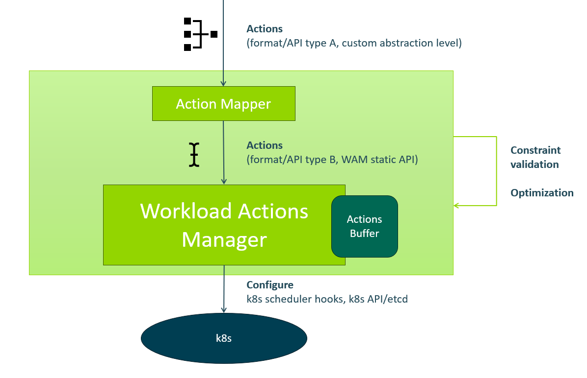

# Workload Actions Manager (WAM)

[](https://www.gnu.org/licenses/gpl-3.0)
[](https://github.com/ACES-EU/workload-actions-manager/actions/workflows/lint_and_test.yaml)



The Workload Actions Manager (WAM) is a specialized service integrated into the Kubernetes control plane, designed to
manage and orchestrate workload actions for Smart AIOps entities. These entities, which include both centralized AIOps
reschedulers and decentralized agents, utilize the WAM API to initiate specific actions. WAM oversees the coordination,
task assignment, and interaction with various components required to perform workload actions such as creating or
removing pods. Due to its distributed architecture, WAM emphasizes parallel and asynchronous execution of actions.
Entities are notified of action completions via a separate endpoint, indicating whether the action was successful or
not.

To ensure high availability and fault tolerance, WAM is deployed with multiple replicas, all accessible through a single
Kubernetes Service with a known domain and port. The system leverages a fault-tolerant persistent message queue to store
scheduling recommendations. AIOps entities interact with WAM by sending action requests through the API, with WAM then
executing these actions efficiently while maintaining fault tolerance.

The design of the WAM component architecture aims to minimize custom logic by delegating tasks to existing Kubernetes
components like the ReplicaSet controller to accomplish the required workload actions. For enhanced flexibility and
customization, the Kubernetes scheduler is extended with custom scheduler plugins, allowing for tailored scheduling
processes to meet unique requirements.

WAM implements four primary actions—create, delete, move, and swap—which are generally sufficient for most directives
from AIOps entities or to implement higher-level actions. While these foundational actions cover most use cases, some
scenarios may necessitate additional logic or more complex actions. The abstraction level required for actions depends
on the output from MLOps entities and the target orchestration technology, necessitating a component that bridges
different abstraction levels. A possible solution is a scheduler-specific action mapping component that converts
scheduler-specific concepts into foundational actions. This component can implement high-level actions using low-level
actions, such as moving an entire application from one edge environment to another, or it may include advanced resource
characterization capabilities, like placing workloads on nodes with fewer than three pods and average RAM utilization
below 50%.

## Requirements

- [Docker](https://docs.docker.com/get-docker/)
- [Kubectl](https://kubernetes.io/docs/tasks/tools/#kubectl)
- [K3d](https://k3d.io/v5.2.2/#installation)
- [Just](https://github.com/casey/just?tab=readme-ov-file#installation)
- [Helm](https://helm.sh/docs/intro/install/)

## Create a Cluster

```bash
grep k3d-registry.localhost /etc/hosts || echo "127.0.0.1 k3d-registry.localhost" | sudo tee -a /etc/hosts
k3d cluster create --config deploy/k3d.yaml --api-port localhost:5443
```

## Build

```bash
just build_and_push

# Possible issue & fix:
# chmod a+x ./wam-scheduler/vendor/k8s.io/code-generator/generate-internal-groups.sh
```

## Deploy

```bash
kubectl create namespace ul
helm install --namespace ul wam-redis deploy/redis
sleep 30 # wait for Redis to start
helm install --namespace ul wam-scheduler deploy/wam-scheduler
helm install --namespace ul wam-app deploy/wam
helm install --namespace ul test-a deploy/test-a
helm install --namespace ul test-b deploy/test-b
kubectl port-forward svc/wam-app 3030:3030
```

## Examples

```bash
#### action.Create

# create a replica of A on node 7
curl -X POST -H "Content-Type: application/json" \
  -d '{"method":"action.Create","params":[{"workload": {"namespace": "ul", "kind": "Deployment", "name": "test-a"}, "node": {"name": "k3d-aces-agent-7"}}], "id":"1"}' \
  http://localhost:3030/rpc
  
# create a replica of A on node 4
curl -X POST -H "Content-Type: application/json" \
  -d '{"method":"action.Create","params":[{"workload": {"namespace": "ul", "kind": "Deployment", "name": "test-a"}, "node": {"name": "k3d-aces-agent-4"}}], "id":"1"}' \
  http://localhost:3030/rpc

#### action.Delete

# delete a replica of A on node 7
export pod_to_delete=$(kubectl get pods -l 'app.kubernetes.io/name=test-a' -n ul -o wide | grep 'k3d-aces-agent-7' | awk '{print $1}' | head -n 1)
echo "$pod_to_delete"
curl -X POST -H "Content-Type: application/json" \
  -d "{\"method\":\"action.Delete\",\"params\":[{\"pod\": {\"namespace\": \"ul\", \"name\": \"$pod_to_delete\"}}], \"id\":\"1\"}" \
  http://localhost:3030/rpc

#### action.Move

# move a replica of A from node 4 to node 7
export pod_to_move=$(kubectl get pods -l 'app.kubernetes.io/name=test-a' -n ul -o wide | grep 'k3d-aces-agent-4' | awk '{print $1}' | head -n 1)
echo "$pod_to_move"
curl -X POST -H "Content-Type: application/json" \
  -d "{\"method\":\"action.Move\",\"params\":[{\"pod\": {\"namespace\": \"ul\", \"name\": \"$pod_to_move\"}, \"node\": {\"name\": \"k3d-aces-agent-7\"}}], \"id\":\"1\"}" \
  http://localhost:3030/rpc
  
#### action.Swap

# create a replica of B on node 4
curl -X POST -H "Content-Type: application/json" \
  -d '{"method":"action.Create","params":[{"workload": {"namespace": "ul", "kind": "Deployment", "name": "test-b"}, "node": {"name": "k3d-aces-agent-4"}}], "id":"1"}' \
  http://localhost:3030/rpc

# create another replica of B on node 4
curl -X POST -H "Content-Type: application/json" \
  -d '{"method":"action.Create","params":[{"workload": {"namespace": "ul", "kind": "Deployment", "name": "test-b"}, "node": {"name": "k3d-aces-agent-4"}}], "id":"1"}' \
  http://localhost:3030/rpc

# swap replica of A (node 7) with replicas of B (node 4)
export pod_to_swap_A=$(kubectl get pods -l 'app.kubernetes.io/name=test-a' -n ul -o wide | grep 'k3d-aces-agent-7' | awk '{print $1}' | head -n 1)
export pod_to_swap_B=$(kubectl get pods -l 'app.kubernetes.io/name=test-b' -n ul -o wide | grep 'k3d-aces-agent-4' | awk '{print $1}' | sort | head -n 1)
echo "$pod_to_swap_A"
echo "$pod_to_swap_B"
curl -X POST -H "Content-Type: application/json" \
  -d "{\"method\":\"action.Swap\",\"params\":[{\"x\": {\"namespace\": \"ul\", \"name\": \"$pod_to_swap_A\"}, \"y\": {\"namespace\": \"ul\", \"name\": \"$pod_to_swap_B\"}}], \"id\": \"1\"}" \
  http://localhost:3030/rpc

#### action.Bind

# Deploy pods in a pending state and use bind action to schedule such pods on desired nodes.
# Creates 2 pods in pending state
kubectl apply -f docs/pending-deployment.yaml

# Pods that are pending and have not been scheduled by wam-scheduler are candidates for scheduling
# (nodeName is not set since wam-scheduler only handles scheduling of pods that are part of some action, such as action.Create, action.Move, ...).

# Fetch one such pending pod
export pod_to_bind=$(kubectl get events -n ul --field-selector reason=FailedScheduling,involvedObject.kind=Pod --sort-by='.lastTimestamp' -o json | jq -r '.items[] | select(.reason = "FailedScheduling") | .involvedObject.name' | sort | uniq | head -1)
echo $pod_to_bind

# For example, bind such pod to node 6.
curl -X POST -H "Content-Type: application/json" \
  -d "{\"method\":\"action.Bind\",\"params\":[{\"pod\": {\"namespace\": \"ul\", \"name\": \"$pod_to_bind\"}, \"node\": {\"name\": \"k3d-aces-agent-6\"}}], \"id\":\"1\"}" \
  http://localhost:3030/rpc
  
#### action.UpdateResources

# Update resources of the deployment.
# This action will create new pods (in pending state) with the desired resources, and delete old pods (all pods of the deployment are eventually recreated).
# Creation of new pods and deletion of old pods is performed by k8s, not by WAM. How new pods are rolled out depends on the strategy:
# https://kubernetes.io/docs/concepts/workloads/controllers/deployment/#strategy

# Action expects the following data:
# {
#   "workload": { // all these fields are required
#     "namespace": "ul",
#     "kind": "Deployment", // if this is 'Pod', its Deployment will be found and all replicas of that deployment will be updated
#     "name": "test-a"
#   },
#   "resources": {
#     "container_name: "example-container" // required     
#     "cpu_request": "100m", // optional, updated only if provided
#     "cpu_limit": "200m", // optional, updated only if provided
#     "memory_request": "500Mi", // optional, updated only if provided
#     "memory_limit": "500Mi", // optional, updated only if provided
#   }
# }

# This will update cpu request and cpu limits
curl -X POST -H "Content-Type: application/json" \
  -d '{"method":"action.UpdateResources","params":[{"workload":{"namespace":"ul","kind":"Deployment","name":"pending-test"},"resources":{"container_name":"example-container","cpu_request":"50m","cpu_limit":"200m"}}], "id":"1"}' \
  http://localhost:3030/rpc
  
# See that a new pending pod with new resource was created. Once that pod with new resources is bound to a node (and is healthy), a pod with old resources is deleted.
# This is then repeated until all pods with old resources are gone.

# Let's bind pods with new resources
export new_resources_pod=$(kubectl get pods -n ul -lapp=$(kubectl get deployment -n ul 'pending-test' -o jsonpath='{.spec.selector.matchLabels.app}') \
    --sort-by=.metadata.creationTimestamp \
    -o jsonpath='{.items[-1].metadata.name}')
echo $new_resources_pod

curl -X POST -H "Content-Type: application/json" \
  -d "{\"method\":\"action.Bind\",\"params\":[{\"pod\": {\"namespace\": \"ul\", \"name\": \"$new_resources_pod\"}, \"node\": {\"name\": \"k3d-aces-agent-6\"}}], \"id\":\"1\"}" \
  http://localhost:3030/rpc

export new_resources_pod2=$(kubectl get pods -n ul -lapp=$(kubectl get deployment -n ul 'pending-test' -o jsonpath='{.spec.selector.matchLabels.app}') \
    --sort-by=.metadata.creationTimestamp \
    -o jsonpath='{.items[-1].metadata.name}')
echo $new_resources_pod2

curl -X POST -H "Content-Type: application/json" \
  -d "{\"method\":\"action.Bind\",\"params\":[{\"pod\": {\"namespace\": \"ul\", \"name\": \"$new_resources_pod2\"}, \"node\": {\"name\": \"k3d-aces-agent-6\"}}], \"id\":\"1\"}" \
  http://localhost:3030/rpc
  
# All pods with new resources have been bound to nodes, and note that all the pods with old resources have been deleted.

#### action.Scale

# Update scale of the deployment.
# When scaling the number of replicas up, new pods are created in pending state. Use action.Bind to place them on nodes.
# When scaling down, some pods are deleted to reach the desired number of replicas. Which to delete, is determined by k8s.

# Action expects the following data:
# {
#   "workload": {
#     "namespace": "ul",
#     "kind": "Deployment", // if this is 'Pod', its Deployment will be found and all scaled up or down
#     "name": "test-a"
#   },
#   "replicas": 5
# }

# This will scale the deployment to 1.
curl -X POST -H "Content-Type: application/json" \
  -d '{"method":"action.Scale","params":[{"workload":{"namespace":"ul","kind":"Deployment","name":"pending-test"}, "replicas": 1}], "id":"1"}' \
  http://localhost:3030/rpc

# Observe only one running pod.

# Now let's scale up to 4 replicas.
curl -X POST -H "Content-Type: application/json" \
  -d '{"method":"action.Scale","params":[{"workload":{"namespace":"ul","kind":"Deployment","name":"pending-test"}, "replicas": 4}], "id":"1"}' \
  http://localhost:3030/rpc

# Observe that one pod is running (from before) and 3 new pods have been created in pending state which should be later scheduled using action.Bind.
```

## Clean up

```bash
k3d cluster stop aces && k3d cluster delete aces
```

## Resources

- https://www.awelm.com/posts/kube-scheduler/
- https://cast.ai/blog/custom-kube-scheduler-why-and-how-to-set-it-up-in-kubernetes/
- https://scheduler-plugins.sigs.k8s.io/docs/user-guide/installation/
- https://kubernetes.io/docs/concepts/scheduling-eviction/scheduling-framework/
- https://medium.com/@juliorenner123/k8s-creating-a-kube-scheduler-plugin-8a826c486a1

## License

This project is licensed under the terms of the GNU General Public License v3.0. See the [LICENSE](LICENSE) file for
details.

© 2024 Faculty of Computer and Information Science, University of Ljubljana
